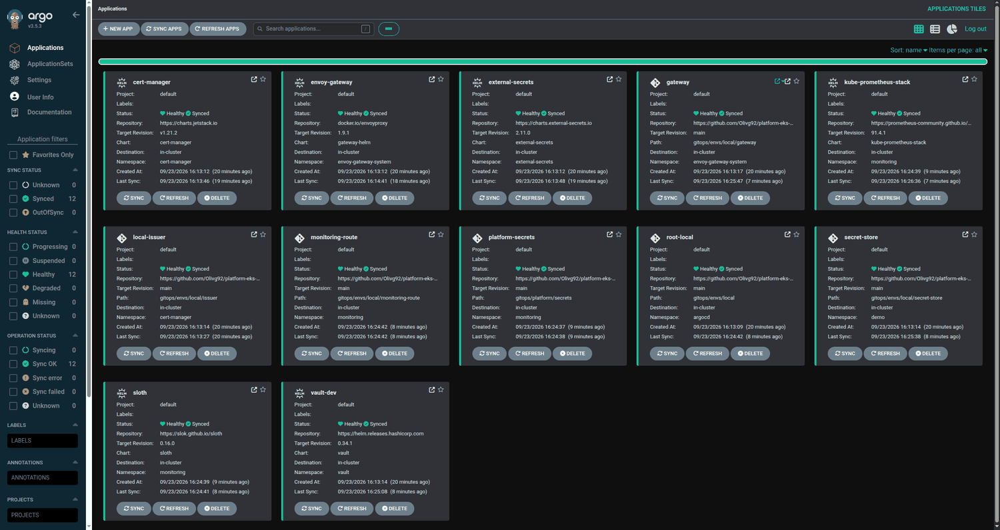
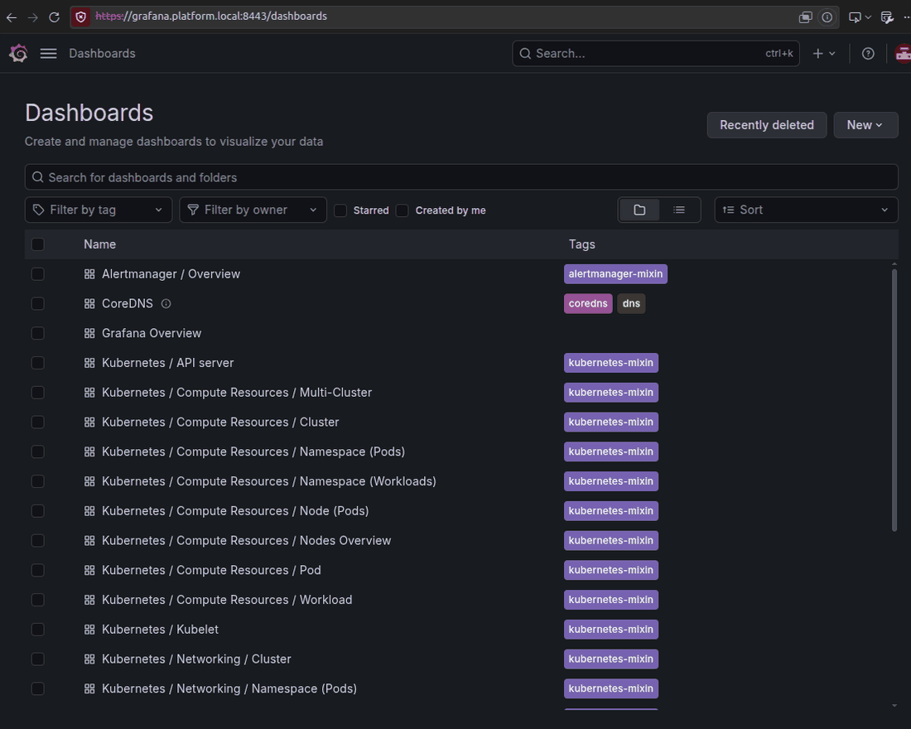
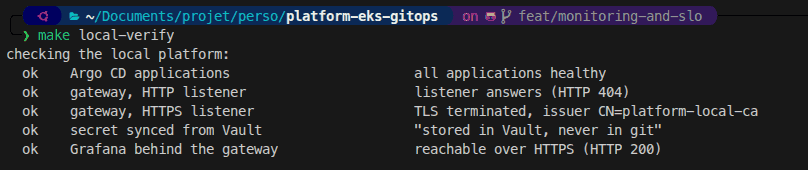

# platform-eks-gitops

A production-style Kubernetes platform on AWS EKS, fully managed with GitOps:
infrastructure as code, secrets management, observability with SLOs, and CI with zero static credentials.

> **Status: work in progress.** The local platform boots with one command; components are being
> added step by step. See the [roadmap](#roadmap).

## Why this project

Running a Kubernetes platform is more than installing a cluster. This repository shows the full lifecycle:

- **Build** it reproducibly: Terraform for AWS, ArgoCD for everything inside the cluster.
- **Operate** it: SLOs with multi-window burn-rate alerts, dashboards and runbooks.
- **Keep it cheap and safe**: one command to create, one to destroy, no NAT Gateway, Spot nodes, no secrets in Git.

Everything runs **locally on k3d first** (free), and on EKS only for validation and demos.

## Architecture

See [docs/architecture.md](docs/architecture.md) for the target architecture diagram.

## Quickstart (local)

No AWS account needed, and nothing to pay: everything runs in Docker.

```bash
git clone https://github.com/Olivg92/platform-eks-gitops.git && cd platform-eks-gitops
make check-tools   # docker, k3d, kubectl, helm, ...
make local-up      # k3d cluster + Argo CD + platform components
```

`make local-up` creates a two-node k3d cluster running the same Kubernetes version as EKS,
installs Argo CD with Helm, and applies a single root Application. Argo CD then installs
everything else from this repository.

When it finishes:

| What | Where |
|---|---|
| Health check | `make local-verify`: applications, gateway, TLS and secrets in one command |
| Argo CD UI | `make argocd-ui`, then http://localhost:8081 (user `admin`, `make argocd-password`) |
| HTTP traffic | http://localhost:8080 (404 until an application attaches a route) |
| HTTPS traffic | `curl -k --resolve grafana.platform.local:8443:127.0.0.1 https://grafana.platform.local:8443/` |
| Grafana | same URL in a browser, user `admin`, `make grafana-password` |
| Demo API | `curl -k --resolve demo.platform.local:8443:127.0.0.1 https://demo.platform.local:8443/` |
| Prometheus | `make prometheus-ui`, then http://localhost:9090 (targets, rules, alerts) |
| Alertmanager | `make alertmanager-ui`, then http://localhost:9093 |
| Applications | `make local-status` |

### What runs on the platform

| Component | Role | Wave |
|---|---|---|
| Envoy Gateway | Gateway API implementation, the single entry point ([ADR 0003](docs/adr/0003-gateway-api-with-envoy-gateway.md)) | -1 |
| cert-manager | Issues the TLS certificate of the gateway listener | -1 |
| External Secrets Operator | Materialises secrets from a store, so none live in git ([ADR 0005](docs/adr/0005-secrets-with-external-secrets-operator.md)) | -1 |
| Vault (dev mode) | Local stand-in for AWS Secrets Manager | -1 |
| kube-prometheus-stack | Prometheus, Alertmanager and Grafana ([ADR 0007](docs/adr/0007-monitoring-baseline-and-slo-generation.md)) | 0 |
| Sloth | Turns SLO objects into multi-window burn-rate rules | 0 |
| [`demo-api`](apps/demo-api/) | Small Python API with an SLO, and a switch to make it fail on demand | 1 |
| Gateway, issuer, secret store, routes | The resources those operators consume | -1 to 1 |

### Service level objectives

The demo API promises two things, declared in [one short object](gitops/apps/demo-api/base/slo.yaml)
that Sloth expands into 30 recording rules and 4 alerts:

| Objective | Target | Error budget over 30 days |
|---|---|---|
| Requests answered without a 5xx | 99.5% | about 3h36m of total failure |
| Requests answered in under 300ms | 99% | about 7h12m of slow requests |

A one-request-per-second probe runs next to the application: with no traffic at all the SLI is
0/0, and the error budget becomes unreadable. Alerting is multi-window burn-rate: a fast pair of windows pages, a slow pair opens a ticket, and
each alert links to [its runbook](docs/runbooks/). Both are reproducible on demand:

```bash
make demo-break RATE=0.2            # 20% of requests fail, on every pod
make demo-load SECONDS=120 RPS=8    # traffic through the gateway
# watch the budget drain in Grafana: demo-api / SLO
make demo-fix
```

The dashboard shows what was delivered next to what was promised, over a window you pick from 1h
to 1y. The value only covers the data Prometheus still holds, which is 24h here: long windows are
a question of retention, not of dashboards.

See [ADR 0008](docs/adr/0008-slo-definitions-for-the-demo-api.md) for why these numbers, and why
latency is counted from a histogram bucket rather than from a percentile.

Install order is expressed with Argo CD sync waves: operators and CRDs first (-2), then the stores
and issuers they need (-1), then the components that consume them (0), then routes and workloads (1).

Secrets never touch this repository. `gitops/envs/local/secret-store/` declares *which* secret is
needed; the value is read from Vault, which trusts the operator's ServiceAccount rather than any
stored token. `make local-verify` prints the value that made the trip.

The application namespace denies all ingress by default and names what is allowed: the gateway,
Prometheus scraping, and the probe next door. Anything else, including a pod in another namespace,
is refused. On EKS this needs the VPC CNI network policy feature, which the Terraform stack enables.

Security checks run on every commit: `gitleaks` for secrets, `checkov` for Terraform, Kubernetes
and Dockerfiles. The checks that are deliberately skipped are listed in
[`.checkov.yaml`](.checkov.yaml), each with the reason. A silenced check without a justification
hides a decision instead of documenting it.

`make local-down` deletes the cluster. Run `make help` for every target.

### What it looks like

One manifest is applied by hand; Argo CD deploys and reconciles everything else.



Grafana, reached through the platform gateway over HTTPS, with the dashboards the monitoring
stack ships. The certificate comes from the cluster's own authority, and the admin password was
generated in the secret store, so it exists nowhere in this repository.



`make local-verify` checks the whole chain in one command:



### Which cluster am I talking to?

Each environment has a kubeconfig file of its own, and every `make` target uses one explicitly:
`~/.kube/platform-eks-gitops-local` for k3d, `~/.kube/platform-eks-gitops-aws` for EKS. The default
`~/.kube/config` is never read and never written, so the targets cannot act on another cluster the
machine happens to know about, and creating the local cluster no longer switches the current context
of whoever was working on something else.

```bash
make context              # the local cluster
make context ENV=aws      # the EKS cluster, or "not running"
```

To use `kubectl` by hand, point it at the same file:

```bash
export KUBECONFIG=~/.kube/platform-eks-gitops-local
```

The scripts shared by both environments refuse to run without `KUBECONFIG` rather than fall back on
the default one.

### Troubleshooting

| Symptom | Cause | Fix |
|---|---|---|
| Pods stuck in `ImagePullBackOff`, events showing `lookup <registry>: Try again` | k3d nodes keep the DNS servers they were created with. Moving between networks, or connecting to a VPN, leaves them pointing at a resolver they can no longer reach. | `make local-restart` |
| `make local-up` fails on the Argo CD install with `context deadline exceeded` | Same cause: the pods never become ready because their images cannot be pulled. | `make local-restart`, then `make local-up` again |
| Grafana rejects the password from `make grafana-password`, usually after a machine reboot | Vault runs in dev mode and keeps nothing on disk, so it regenerates the password on restart. Grafana only reads it when it starts, so it still holds the previous one. | `make grafana-reload` |
| An application stays `OutOfSync` while everything is healthy | Expected while testing a branch: the root application is paused on purpose (see [Development](#development)). | `make local-bootstrap` once the branch is merged |

## Continuous integration

Every pull request runs the same checks as a developer machine, from the same
[`.pre-commit-config.yaml`](.pre-commit-config.yaml): a check that only exists in CI is a check
nobody can reproduce before pushing.

| Job | What it catches |
|---|---|
| lint and security | Terraform format, validation, tflint and checkov; kubeconform and yamllint on manifests; gitleaks for secrets; actionlint for the workflows themselves |
| demo-api tests | The pytest suite, including the test that pins the metric labels the SLOs depend on |
| manifests render | Every kustomization under `gitops/` rendered and validated, 13 today. The environment roots only list Argo CD Applications; the patches that can break live one level down, so each one is rendered |
| demo-api image | Built and scanned with Trivy when the application changes. Findings go to the Security tab; a fixable critical one fails the build. Published to GHCR on `main` only, tagged with the commit sha |

`scripts/render-manifests.sh` is the same render check, runnable locally.

Actions are pinned to a commit rather than a tag, since a tag can be moved to point at different
code. Dependabot raises the pull requests that bump those pins, so pinning does not mean going stale.

## Repository layout

| Path | Content |
|---|---|
| [`local/`](local/) | k3d cluster definition and Argo CD values for the local environment |
| [`terraform/`](terraform/) | AWS infrastructure: state bootstrap, modules (VPC, EKS, IAM), demo environment |
| [`gitops/`](gitops/) | Everything ArgoCD deploys: app-of-apps, platform components, applications |
| [`apps/demo-api/`](apps/demo-api/) | Demo API used to showcase SLOs |
| [`docs/`](docs/) | Architecture, [decision records](docs/adr/), runbooks |
| [`.github/workflows/`](.github/workflows/) | CI pipelines |
| [`scripts/`](scripts/) | Development helpers, not part of the GitOps flow |

## Technical choices

Each non-trivial decision is documented as an [Architecture Decision Record](docs/adr/).

This repository is built with the help of an AI assistant, framed by the rules in
[CLAUDE.md](CLAUDE.md): cost, security and simplicity constraints it has to respect. Every choice
here is one I can explain and defend.

## Cost

Measured, not estimated: a session where the cluster lived for one hour and seven minutes, billed
in eu-north-1 with credits excluded.

| Service | Cost | Share |
|---|---|---|
| EKS control plane | $0.1119 | 46% |
| Load balancer | $0.0479 | 20% |
| Cost Explorer API | $0.0400 | 16% |
| EC2, two spot nodes | $0.0187 | 8% |
| VPC, public IPv4 addresses | $0.0162 | 7% |
| EBS, 40 GB | $0.0087 | 4% |
| Secrets Manager, S3 | $0.0013 | 1% |
| **Total** | **$0.2446** | |

About **$0.18 per hour**, and three things worth noticing.

**The control plane is nearly half the bill and the compute is 8%.** Shrinking the nodes would save
almost nothing: what saves money is destroying the cluster, which is why `make down` exists and why
the teardown verifies itself.

**Measuring the cost costs money.** Every `make cost` is a Cost Explorer call billed at $0.01, and
four of them make up 16% of this bill. Worth knowing before putting one in a loop.

**The load balancer cost twice what it should have.** A botched teardown left two of them running
for a few minutes, because Argo CD recreated the gateway while it was being deleted. The incident is
in [the runbook](docs/runbooks/), and it has a price tag.

For reference, the same platform with the usual production defaults would add a NAT Gateway per
zone, around $0.09 per hour before traffic, which is more than everything above combined.

The EKS environment is meant to live for a few hours, then be destroyed with `make down`.
The measured cost of a demo session will be documented here.

## What I would do differently in production

_To be written: multi-AZ, Karpenter, backups with Velero, policies with Kyverno, and more._

## Roadmap

- [x] Repository layout, linting and secret scanning (pre-commit)
- [x] Local platform on k3d: Argo CD (app-of-apps) and Gateway API with Envoy Gateway
- [x] cert-manager and TLS, External Secrets Operator with no secret in git
- [x] Prometheus, Alertmanager, Grafana and Sloth, with Grafana behind the gateway
- [ ] Demo API with SLOs, burn-rate alerts, dashboard and runbooks
- [ ] AWS EKS with Terraform (no NAT, Spot nodes, Pod Identity)
- [ ] CI with GitHub Actions and OIDC authentication to AWS
- [ ] Documentation: ADRs, screenshots, production notes

## Development

```bash
make lint   # all pre-commit checks: formatting, YAML, Terraform, manifests, secrets
```

Applications committed here track `main`, which is the source of truth. To try a branch before
merging it, push the branch and run `make local-up REVISION=my-branch`: the root Application
follows that branch and [`scripts/dev-follow-revision.sh`](scripts/dev-follow-revision.sh)
repoints the others at it.
