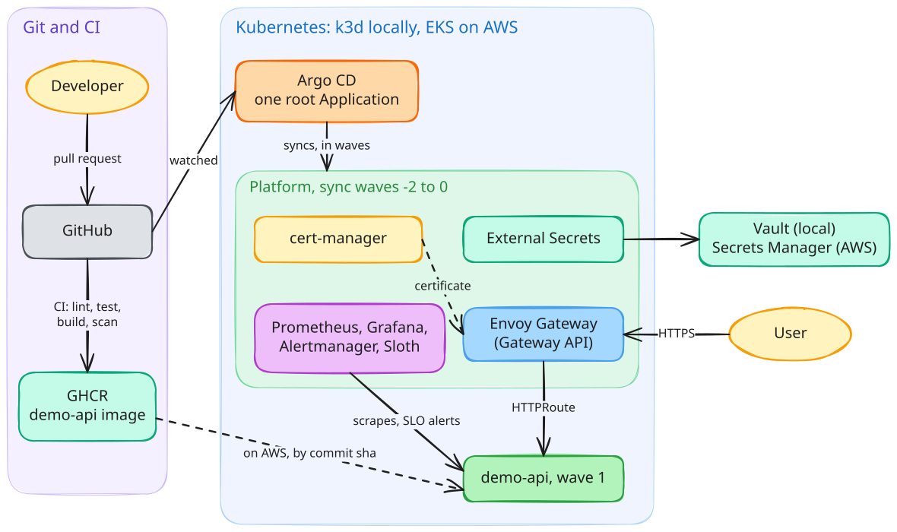
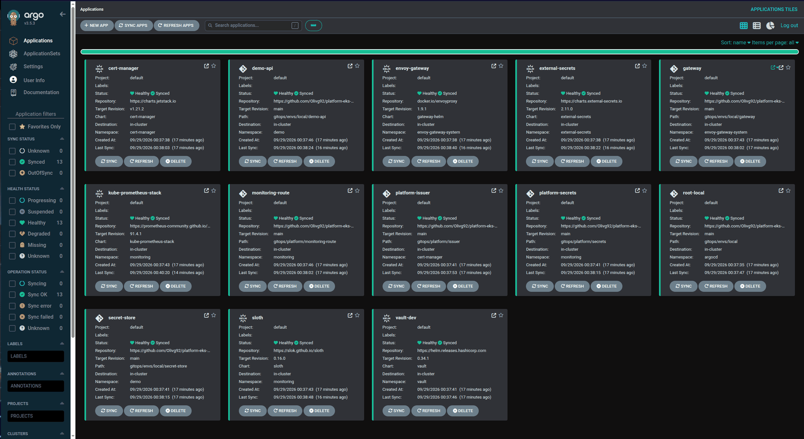
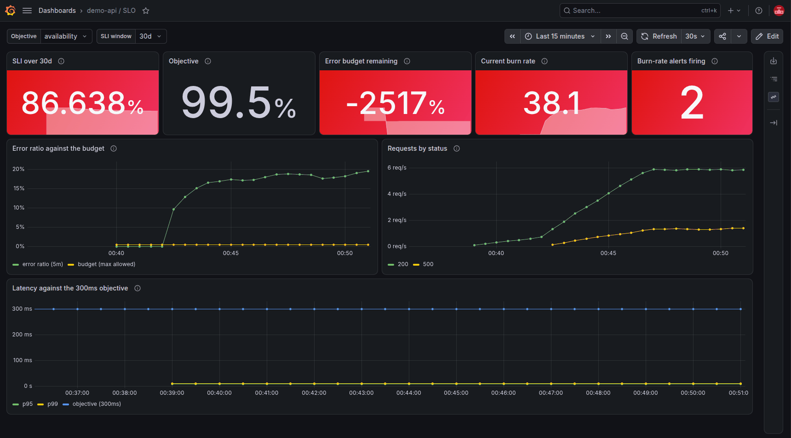
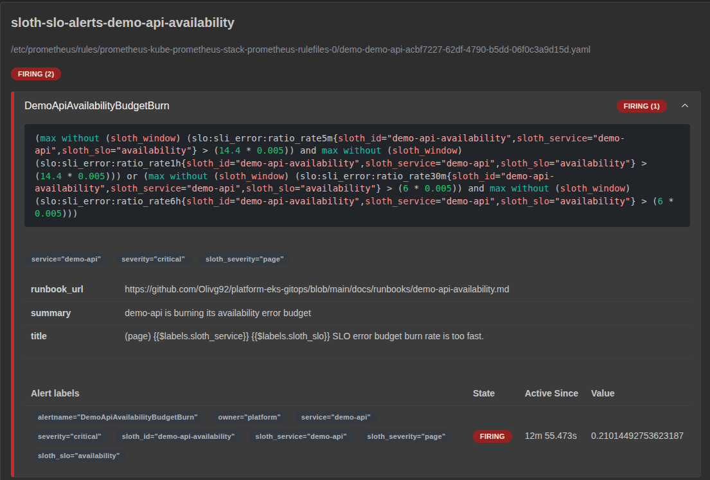
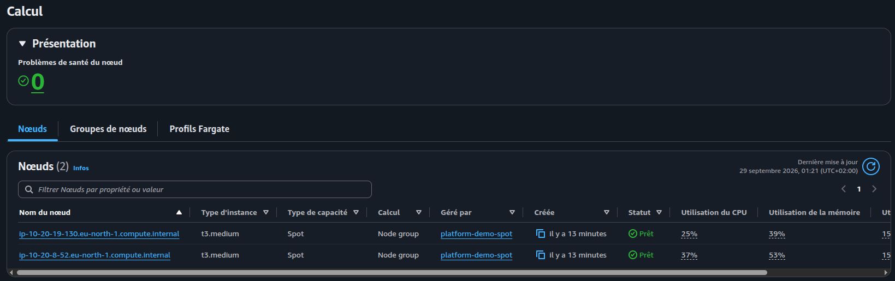

# platform-eks-gitops

[](https://github.com/Olivg92/platform-eks-gitops/actions/workflows/ci.yml)
[](https://github.com/Olivg92/platform-eks-gitops/actions/workflows/image.yml)
[](https://github.com/Olivg92/platform-eks-gitops/actions/workflows/image-freshness.yml)

A Kubernetes platform on AWS EKS, run entirely through GitOps: Terraform for the cloud, Argo CD for
everything inside the cluster, secrets that never touch git, and SLOs that page before users
notice. It runs locally on k3d for free, and on EKS for about $0.18 an hour.

## What this repository shows

- **One manifest applied by hand.** Argo CD installs and reconciles everything else from this
  repository, in dependency order, and rebuilds the same platform on k3d and on EKS.
- **No static credential anywhere.** Secrets are materialised by External Secrets from Vault or
  AWS Secrets Manager; workloads reach AWS through EKS Pod Identity; CI is written for OIDC only.
- **Reliability measured, not assumed.** Two SLOs on a demo API, multi-window burn-rate alerts
  generated by Sloth, a runbook per alert, and a switch to break the service and watch the error
  budget burn.
- **A supply chain that stays clean.** The demo image has zero known vulnerabilities, is scanned on
  every build and rescanned every week; every action, image and dependency is pinned, and bumped by
  Dependabot.
- **Cheap by design, and proven.** No NAT Gateway, Spot nodes, a measured cost of $0.18 an hour,
  and a teardown that fails if anything is left billing.
- **Every non-trivial decision written down**, in [12 decision records](docs/adr/).

## Architecture



The same manifests run in both places: a shared base, and an overlay per environment for what
differs (secret store, load balancer, image). On AWS, Terraform creates what the cluster runs on: a
VPC with public subnets and no NAT Gateway, EKS with two Spot nodes, and the secrets in Secrets
Manager. The network load balancer in front of the gateway is requested by Kubernetes itself, which
is why `make down` deletes it before destroying the rest. [docs/architecture.md](docs/architecture.md)
follows a request and a secret through the platform.

## Quickstart (local)

No AWS account needed, and nothing to pay: everything runs in Docker.

```bash
git clone https://github.com/Olivg92/platform-eks-gitops.git && cd platform-eks-gitops
make check-tools   # docker, k3d, kubectl, helm, ...
make local-up      # k3d cluster + Argo CD + platform components
```

Measured from a fresh clone: **4 minutes 33 seconds** until `make local-verify` is all green, with
every platform image downloaded from scratch. The cluster then uses about 5.5 GB of memory: plan
for Docker with 8 GB to spare.

```text
$ make local-verify
checking the local platform:
  ok    Argo CD applications                       all applications healthy
  ok    gateway, HTTP listener                     listener answers (HTTP 404)
  ok    gateway, HTTPS listener                    TLS terminated, issuer CN=platform-local-ca
  ok    secret synced from Vault                   "stored in Vault, never in git"
  ok    Grafana behind the gateway                 reachable over HTTPS (HTTP 200)
  ok    demo API behind the gateway                answers through the gateway
  ok    demo API scraped by Prometheus             ServiceMonitor in place
  ok    SLO rules from Sloth                       6 rule groups generated by Sloth
  ok    SLO dashboard in Grafana                   dashboard shipped with the application
```

`make local-up` creates a two-node k3d cluster running the same Kubernetes version as EKS, installs
Argo CD with Helm, and applies a single root Application. Argo CD then installs everything else
from this repository.

When it finishes:

| What | Where |
|---|---|
| Health check | `make local-verify`: applications, gateway, TLS and secrets in one command |
| Argo CD UI | `make argocd-ui`, then http://localhost:8081 (user `admin`, `make argocd-password`) |
| Grafana | https://grafana.platform.local:8443, user `admin`, `make grafana-password` (see below for the hostname) |
| Demo API | `curl -k --resolve demo.platform.local:8443:127.0.0.1 https://demo.platform.local:8443/` |
| Prometheus | `make prometheus-ui`, then http://localhost:9090 (targets, rules, alerts) |
| Alertmanager | `make alertmanager-ui`, then http://localhost:9093 |
| Applications | `make local-status` |

The gateway serves `*.platform.local` on port 8443. For a browser, add
`127.0.0.1 grafana.platform.local demo.platform.local` to `/etc/hosts`; the certificate comes from
the cluster's own authority, so the browser warns once.

`make local-down` deletes the cluster. `make help` lists every target, and
[docs/operations.md](docs/operations.md) covers which cluster a command talks to, troubleshooting,
and testing a branch.

### What runs on the platform

| Component | Role | Wave |
|---|---|---|
| Envoy Gateway | Gateway API implementation, the single entry point ([ADR 0003](docs/adr/0003-gateway-api-with-envoy-gateway.md)) | -1 |
| cert-manager | Issues the TLS certificate of the gateway listener | -1 |
| External Secrets Operator | Materialises secrets from a store, so none live in git ([ADR 0005](docs/adr/0005-secrets-with-external-secrets-operator.md)) | -1 |
| Vault (dev mode) | Local stand-in for AWS Secrets Manager | -1 |
| kube-prometheus-stack | Prometheus, Alertmanager and Grafana ([ADR 0007](docs/adr/0007-monitoring-baseline-and-slo-generation.md)) | 0 |
| Sloth | Turns SLO objects into multi-window burn-rate rules | 0 |
| [`demo-api`](apps/demo-api/) | Small Python API with an SLO, and a switch to make it fail on demand | 1 |
| Gateway, issuer, secret store, routes | The resources those operators consume | -1 to 1 |

Install order is expressed with Argo CD sync waves: operators and CRDs first (-2), then the stores
and issuers they need (-1), then the components that consume them (0), then routes and workloads (1).



## Watch it break

The demo API promises two things, declared in [one short object](gitops/apps/demo-api/base/slo.yaml)
that Sloth expands into 30 recording rules and 4 alerts:

| Objective | Target | Error budget over 30 days |
|---|---|---|
| Requests answered without a 5xx | 99.5% | about 3h36m of total failure |
| Requests answered in under 300ms | 99% | about 7h12m of slow requests |

Alerting is multi-window burn-rate: a fast pair of windows pages, a slow pair opens a ticket, and
each alert links to [its runbook](docs/runbooks/). A one-request-per-second probe runs next to the
application, since with no traffic at all the SLI is 0/0 and the budget becomes unreadable.

Both failures are reproducible on demand:

```bash
make demo-break RATE=0.2            # 20% of requests fail, on every pod
make demo-load SECONDS=120 RPS=8    # traffic through the gateway
# watch the budget drain in Grafana: demo-api / SLO
make demo-fix
```



With one request in five failing, the budget of a 99.5% objective burns 38 times faster than it can
afford. Both alerts fired within three minutes here, because the cluster had just started and every
window held only those minutes. With a full history the long windows take longer to agree, which is
the point of multi-window alerting: a short blip does not page anyone.



The dashboard shows what was delivered next to what was promised, over a window you pick from 1h
to 1y. The value only covers the data Prometheus still holds, which is 24h here: long windows are
a question of retention, not of dashboards. [ADR 0008](docs/adr/0008-slo-definitions-for-the-demo-api.md)
explains these numbers, and why latency is counted from a histogram bucket rather than a
percentile.

## Security

- **Secrets never touch this repository.** Manifests declare *which* secret is needed; External
  Secrets reads the value from Vault locally, from Secrets Manager on AWS. Vault trusts the
  operator's ServiceAccount, Secrets Manager trusts its Pod Identity: neither holds a stored token.
  Terraform generates the Grafana password as an ephemeral value, so it is not in the state either.
- **The application namespace denies all ingress by default** and names what is allowed: the
  gateway, Prometheus, and the probe. On EKS this relies on the VPC CNI network policy feature,
  which the Terraform stack enables.
- **Checks on every commit**: gitleaks for secrets, checkov for Terraform, Kubernetes and
  Dockerfiles, Trivy on the image. The checks deliberately skipped are listed in
  [`.checkov.yaml`](.checkov.yaml), each with its reason: a silenced check without a justification
  hides a decision instead of documenting it.
- **CI holds no AWS credential.** Everything is pinned and bumped by Dependabot; see
  [docs/ci.md](docs/ci.md) for the jobs, and for the OIDC setup this account type does not allow.

## Running it on AWS

This part costs money: about $0.18 an hour, while the cluster exists.

Once per account: apply [`terraform/bootstrap`](terraform/bootstrap/) for the state bucket, then
copy `backend.hcl.example` and `terraform.tfvars.example` in `terraform/envs/demo/`. After that:

```bash
make plan         # what would be created, without creating it
make up           # VPC, EKS, 2 Spot nodes, Argo CD, then the platform
make aws-verify   # the same end-to-end check as locally
make down         # destroy everything, then fail if anything is still billing
```

Measured on the last session: `make up` takes about 18 minutes, 11 of them in Terraform, most of
which is the EKS control plane, and 7 for Argo CD to install the platform. `make down` takes 10 to
15 minutes, most of it EKS deleting the node group and then the cluster. In between, the same checks as locally, plus what only exists on AWS:

```text
$ make aws-verify
checking the platform on EKS:
  ok    Argo CD applications                       all applications healthy
  ok    nodes running on spot capacity             2 of 2 nodes on spot capacity
  ok    secret store (Pod Identity)                Secrets Manager reachable with Pod Identity
  ok    secret from Secrets Manager                credentials materialised for "admin"
  ok    gateway load balancer                      a176e365ae8e...elb.eu-north-1.amazonaws.com
  ok    Grafana behind the gateway                 reachable over HTTPS (HTTP 200)
  ok    demo API behind the gateway                answers through the load balancer
  ok    demo API image                             published by CI, sha-339a41ab09ce
  ok    demo API scraped by Prometheus             ServiceMonitor in place
  ok    SLO rules from Sloth                       6 rule groups generated by Sloth
```



The API endpoint of the cluster is public but restricted to the address of the machine that ran
`make up`, and Terraform refuses `0.0.0.0/0` outright. `make down` stops Argo CD before deleting
the gateway, since Argo CD would otherwise recreate the load balancer it is deleting; the
[runbooks](docs/runbooks/README.md#tearing-down-the-aws-environment) explain why the order matters.

## Technical choices

| Decision | Why | Record |
|---|---|---|
| App-of-apps with a single root Application | The whole platform comes back from git with one manifest applied by hand | [0002](docs/adr/0002-app-of-apps-for-platform-components.md) |
| Gateway API, implemented by Envoy Gateway | The successor of Ingress; the platform owns the listener, applications own their routes | [0003](docs/adr/0003-gateway-api-with-envoy-gateway.md) |
| Argo CD installed with Helm, then left to git | The one step that cannot be GitOps, kept to a pinned chart and a root Application | [0004](docs/adr/0004-bootstrap-argocd-with-helm.md) |
| External Secrets Operator | No secret in git, and the same manifests over Vault or Secrets Manager | [0005](docs/adr/0005-secrets-with-external-secrets-operator.md) |
| Shared base, one overlay per environment | k3d and EKS differ in a few patches, not in two copies | [0006](docs/adr/0006-shared-base-with-environment-overlays.md) |
| kube-prometheus-stack, SLO rules generated by Sloth | A standard baseline, and burn-rate rules nobody has to write by hand | [0007](docs/adr/0007-monitoring-baseline-and-slo-generation.md), [0008](docs/adr/0008-slo-definitions-for-the-demo-api.md) |
| Public subnets, no NAT Gateway | A NAT Gateway would cost more than the rest of the stack; strict security groups and IMDSv2 instead | [0009](docs/adr/0009-public-subnets-without-a-nat-gateway.md) |
| EKS Pod Identity rather than IRSA | No OIDC provider to manage, and the only one of the two this account allows | [0010](docs/adr/0010-pod-identity-for-workload-credentials.md) |
| Chainguard base image, pinned by digest | Zero known vulnerabilities, against 159 on `python:slim` | [0011](docs/adr/0011-runtime-image-with-no-known-vulnerabilities.md) |
| CI reaches AWS through OIDC or not at all | No access key as a fallback, even when the account forbids OIDC | [0012](docs/adr/0012-ci-reaches-aws-through-oidc.md) |

This repository is built with the help of an AI assistant, framed by the rules in
[CLAUDE.md](CLAUDE.md): cost, security and simplicity constraints it has to respect. Every choice
here is one I can explain and defend.

## Cost

Measured, not estimated: a session where the cluster lived for one hour and seven minutes, billed
in eu-north-1 with credits excluded.

| Service | Cost | Share |
|---|---|---|
| EKS control plane | $0.1119 | 46% |
| Load balancer | $0.0479 | 20% |
| Cost Explorer API | $0.0400 | 16% |
| EC2, two spot nodes | $0.0187 | 8% |
| VPC, public IPv4 addresses | $0.0162 | 7% |
| EBS, 40 GB | $0.0087 | 4% |
| Secrets Manager, S3 | $0.0013 | 1% |
| **Total** | **$0.2446** | |

About **$0.18 per hour**, and three things worth noticing.

**The control plane is nearly half the bill and the compute is 8%.** Shrinking the nodes would save
almost nothing: what saves money is destroying the cluster, which is why `make down` exists and why
the teardown verifies itself.

**Measuring the cost costs money.** Every `make cost` is a Cost Explorer call billed at $0.01, and
four of them make up 16% of this bill. Worth knowing before putting one in a loop.

**The load balancer cost twice what it should have.** A botched teardown left two of them running
for a few minutes, because Argo CD recreated the gateway while it was being deleted. The incident is
in [the runbook](docs/runbooks/), and it has a price tag.

For reference, the same platform with the usual production defaults would add a NAT Gateway per
zone, around $0.09 per hour before traffic, which is more than everything above combined.

## What I would do differently in production

This is a demo environment, built to be rebuilt from git every session. A production platform keeps
running, holds state, and has to be operated by more than one person; each line below is what that
changes, and why it is not here.

| Area | Here | In production | Why not here |
|---|---|---|---|
| Availability | 2 zones, 2 Spot nodes of a fixed size | 3 zones, an on-demand node group for system components, Spot for stateless workloads, disruption budgets and topology spread | Cost, and nothing here must survive a zone |
| Node scaling | A fixed node group | Karpenter, for consolidation and diverse Spot capacity | This account type denies `ec2:CreateFleet`, which Karpenter launches nodes with |
| Network | Public subnets, public API endpoint restricted to one address | Private subnets behind a NAT Gateway per zone, or VPC endpoints; a private API endpoint reached through a VPN | A NAT Gateway per zone costs more than this whole cluster ([ADR 0009](docs/adr/0009-public-subnets-without-a-nat-gateway.md)) |
| Admission policy | checkov and Trivy in CI | Kyverno or ValidatingAdmissionPolicy in the cluster: requests set, non-root, no mutable tags, signed images only | CI covers the only author; a cluster shared by teams needs the check at the door |
| Supply chain | Scanned and pinned images | Images signed with cosign, keyless through OIDC, SBOM attached, signatures verified at admission | One image, built by one pipeline |
| Secrets | Generated at apply time, rotated by rebuilding | Rotation through the owning system's API, and Reloader to restart what reads a secret when it changes | Each `make up` already starts from new secrets; the Grafana password drift after a local restart is the problem Reloader solves |
| Alerting | Alertmanager sends nowhere; alerts are read in its UI | A pager for the fast burn, tickets for the slow one, and the always-firing Watchdog sent to a dead man's switch, so that a silent alerting pipeline is itself an alert | Nobody is on call for a demo |
| Observability | Metrics only, kept 24 hours | Long-term metrics in Thanos, Mimir or Amazon Managed Prometheus; logs and traces with Loki, Tempo and OpenTelemetry | Retention is storage, and storage is cost on a cluster that lives for an afternoon |
| Control plane | No control plane logs, secrets encrypted with the AWS managed key | API, audit and authenticator logs; envelope encryption with a customer managed key | Audit logs cost more than the cluster; a KMS key survives `make down` for its waiting period |
| Backups | None: git and the versioned state bucket are the backup | Velero for cluster resources and volumes, tested by restoring | Nothing stateful runs here |
| Delivery | `main` is deployed; a branch can be tried locally | A plan on every infrastructure pull request, scheduled drift detection, staged environments in separate accounts, progressive rollouts | OIDC is off on this account ([ADR 0012](docs/adr/0012-ci-reaches-aws-through-oidc.md)), and one environment has nowhere to promote to |

## Repository layout

| Path | Content |
|---|---|
| [`local/`](local/) | k3d cluster definition and Argo CD values for the local environment |
| [`terraform/`](terraform/) | AWS infrastructure: state bootstrap, modules (VPC, EKS, IAM), demo environment |
| [`gitops/`](gitops/) | Everything Argo CD deploys: app-of-apps, platform components, applications |
| [`apps/demo-api/`](apps/demo-api/) | Demo API used to showcase SLOs |
| [`docs/`](docs/) | [Architecture](docs/architecture.md), [operations](docs/operations.md), [CI](docs/ci.md), [decision records](docs/adr/), [runbooks](docs/runbooks/) |
| [`.github/workflows/`](.github/workflows/) | CI pipelines |
| [`scripts/`](scripts/) | Helpers the Makefile and CI call, not part of the GitOps flow |

## Status

Complete: the platform, its SLOs, the AWS environment and the CI are in place, and kept current by
Dependabot and the weekly image freshness check. Logs and traces next to the metrics would be the
next addition.

## Development

```bash
make lint   # every pre-commit check: formatting, YAML, Terraform, manifests, secrets
```

The same checks run in CI on every pull request. To try a branch on the local cluster before
merging it, see [testing a branch](docs/operations.md#testing-a-branch).
