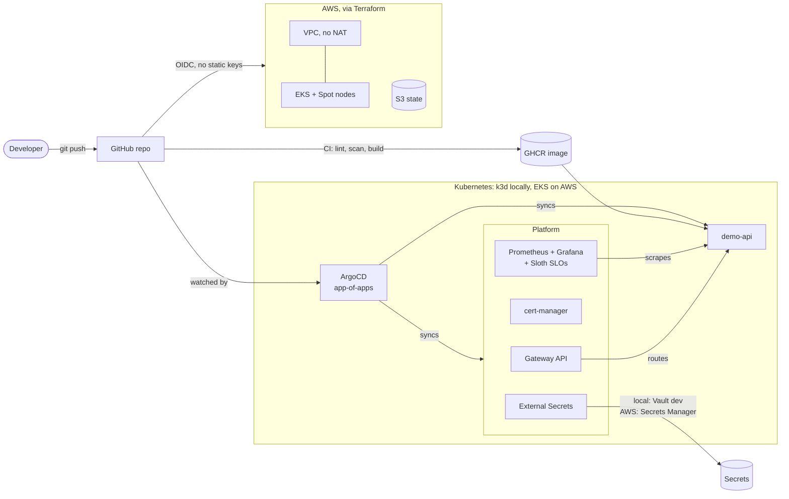

# Architecture

> Target architecture. Components are added step by step (see [PLAN.md](../PLAN.md)).

```mermaid
flowchart LR
    dev([Developer]) -->|git push| gh[GitHub repo]
    gh -->|CI: lint, scan, build| ghcr[(GHCR image)]
    gh -->|OIDC, no static keys| aws

    subgraph cluster[Kubernetes: k3d locally, EKS on AWS]
        argocd[ArgoCD<br/>app-of-apps] -->|syncs| platform
        argocd -->|syncs| app
        subgraph platform[Platform]
            gw[Gateway API]
            cm[cert-manager]
            eso[External Secrets]
            prom[Prometheus + Grafana<br/>+ Sloth SLOs]
        end
        app[demo-api]
    end

    gh -->|watched by| argocd
    ghcr --> app
    eso -->|local: Vault dev<br/>AWS: Secrets Manager| secrets[(Secrets)]
    prom -->|scrapes| app
    gw -->|routes| app

    subgraph aws[AWS, via Terraform]
        vpc[VPC, no NAT] --- eks[EKS + Spot nodes]
        s3[(S3 state)]
    end
```
