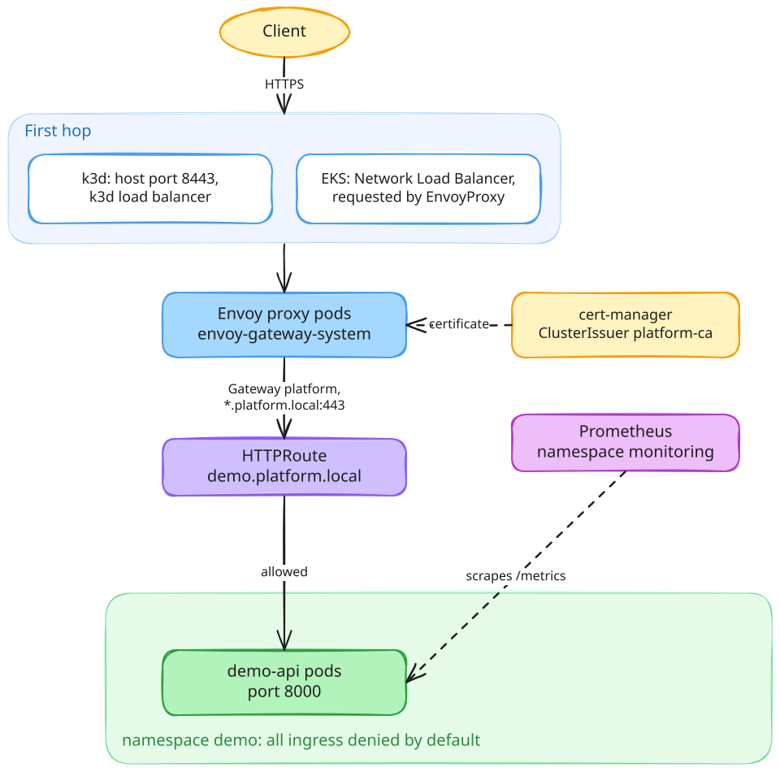
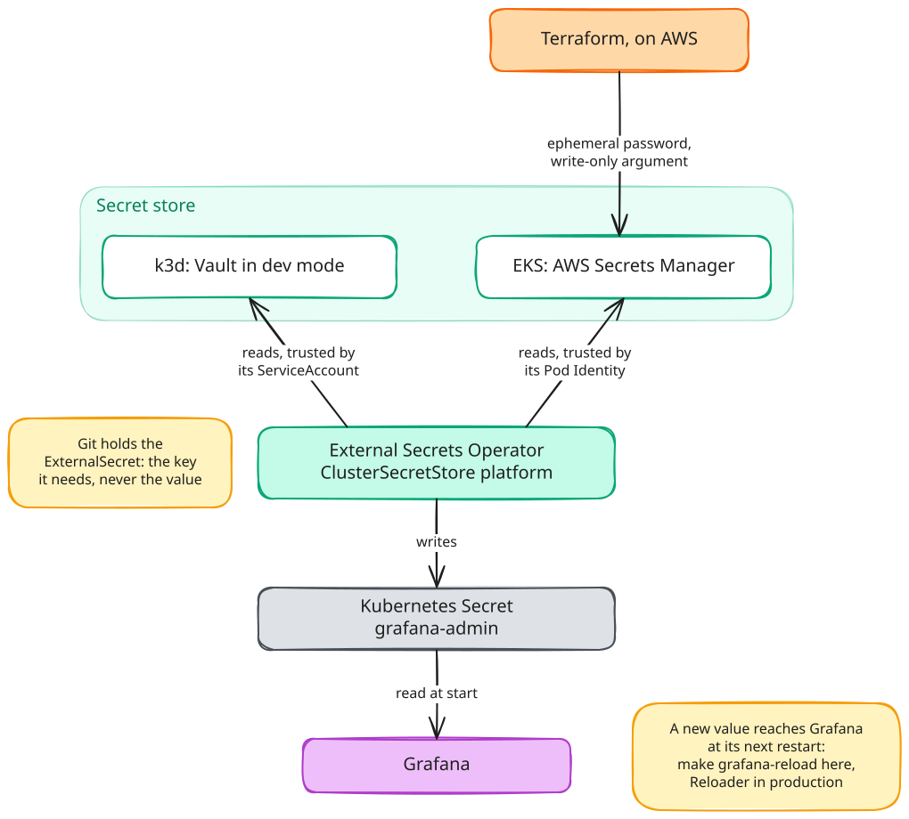

# Architecture

The [README](../README.md#architecture) has the overview. This page follows two things through the
platform: a request, and a secret. Both take the same path on k3d and on EKS; only the first hop
and the secret store change.

The diagrams are Excalidraw drawings saved as `.excalidraw.svg`: the scene is embedded in the image,
so opening the file in [excalidraw.com](https://excalidraw.com) or the Excalidraw extension for VS
Code edits it directly, and saving it updates the image these pages show.

## A request

- **One gateway, owned by the platform.** Applications attach `HTTPRoute` objects from their own
  namespace; they never open a port of their own ([ADR 0003](adr/0003-gateway-api-with-envoy-gateway.md)).
- **TLS ends at the gateway**, with a wildcard certificate issued by the cluster's own authority.
  A public name and a public issuer would replace it in production; nothing else would change.
- **The application namespace denies all ingress by default.** Traffic from the gateway,
  Prometheus and the probe is allowed by name, and anything else, a pod in another namespace
  included, is refused.

## A secret

- **Git holds the name of a secret, never its value.** The `ExternalSecret` says which key it
  needs; the operator fetches it and writes an ordinary Kubernetes Secret
  ([ADR 0005](adr/0005-secrets-with-external-secrets-operator.md)).
- **No token is stored to reach the store.** Locally, Vault trusts the operator's ServiceAccount;
  on EKS, the Pod Identity association hands its pod short-lived AWS credentials, for two named
  secrets only ([ADR 0010](adr/0010-pod-identity-for-workload-credentials.md)).
- **On AWS, the value is not in the Terraform state either.** The password is generated as an
  ephemeral value and sent to Secrets Manager through a write-only argument.
- **Consumers read a secret when they start.** A rotated value reaches Grafana on its next restart,
  which is what `make grafana-reload` does by hand and Reloader would do in production.
